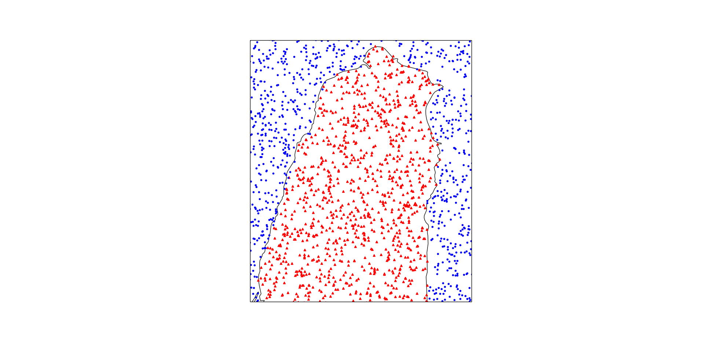
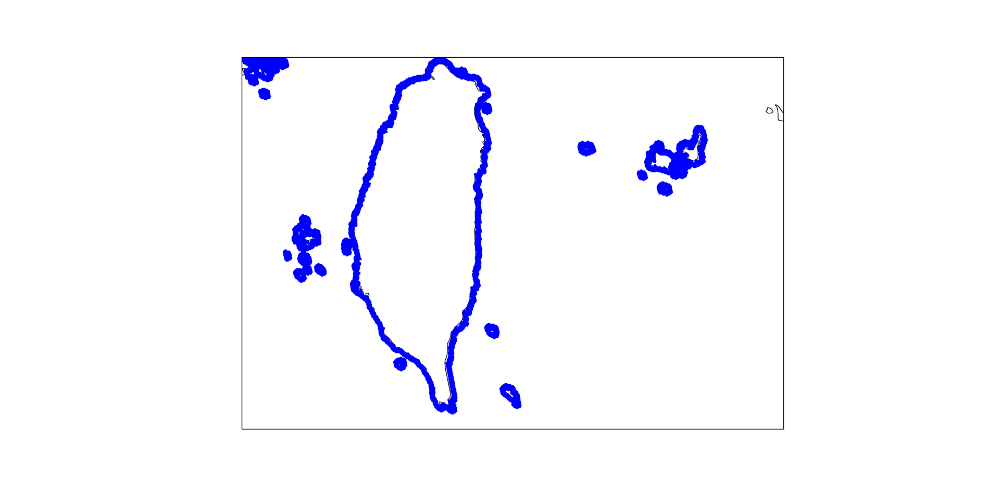
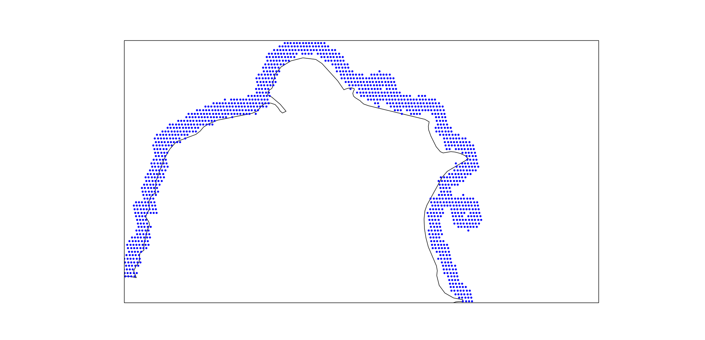

# GeoCode

> some function about geography

---

## land sea sepration

+ Identify a position is on land or sea or coastline(given coastline distance).
+ this package is based on [global_land_mask](https://github.com/toddkarin/global-land-mask)
+ 
+ 
+ 

## reverse_geocode_cn

+ Identify a position's country_name(in chinese)
+ this package is based on  [reverse_geocode](https://pypi.org/project/reverse-geocode/1.0/)
